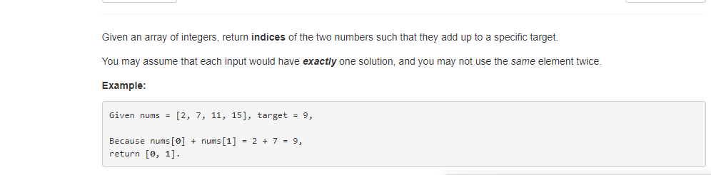

### #1 数组两数相加得到指定值
#### 问题描述


给定一个整数数组，以及某个数值，返回两数之和为该数值的数值两数下标。假设每次输入都有确定的输出，并且不可以使用同一个
两次。

#### 解答
这道题作为leetcode的开胃菜，比较简单。这里提供python的一种解法，首先遍历数组，取得当前数item，以及下标
index, 获取数组的一个copy，叫list，从list中去掉item本身，如果list中包含target-item（设为a)的值，即返回index和a
的下标。这里注意一下，如果a和item相等，nums.index(a)获取的是item的小标，所以需要用list.index(a)+1即得到a本身在nums
里的下标。

解法如下：
```python
import copy

def two_sum(nums, target):
    for index, item in enumerate(nums): 
            a = target - item
            list = copy.copy(nums)
            del list[index]
            if a in list:
                if nums.index(a) == index:
                    return [index, list.index(a)+1]
                return [index, nums.index(a)]
```