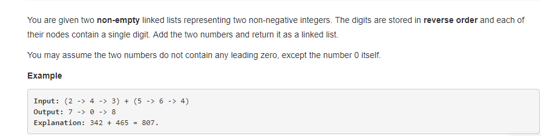
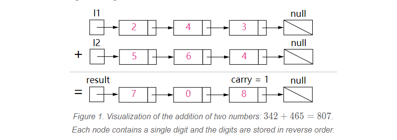

## #2 使用链表实现两数相加
### 问题描述

给定两个代表非负整数的非空链表，数字以反向的形式存放在链表中，并且每个节点包含一个数字，请将两个数值相加求和并且存放在链表
中返回。假设里两个数值都不包含开首的0数字，除了0数值本身。
如输入：`( 2 -> 4 -> 3) + ( 5 -> 6-> 4 )`
输出： ` 7 -> 0 -> 9 `
因为： `342 + 465 = 807`

### 解答
两数相加的计算本不是什么难题，在本题中将数字存放在链表中，也考察了链表使用的熟练程度，这里就不介绍链表知识点的普及了。
本题中需要注意两个点，一个是当某一个链表遍历结束的处理，一个是进位的处理。我们用carry值表示进位的数值，`carry = (a(l1)
+b(l2)+carry（上一次计算的carry值)) / 10`,val表示当前节点值 `(a + b + carry)%10`,存放到链表中
简单计算流程如下：
 
 
```python
# Definition for singly-linked list.
# class ListNode(object):
#     def __init__(self, x):
#         self.val = x
#         self.next = None

class Solution(object):
    def addTwoNumbers(self, l1, l2):
        """
        :type l1: ListNode
        :type l2: ListNode
        :rtype: ListNode
        """
        head = None
        link = None
        carry = 0  #表示进位,初始进位值为0
        while l1 or l2:  #循环结束的条件是链表1和链表二都遍历结束
            total = (l1.val if l1 else 0) + (l2.val if l2 else 0) + carry
            val = total % 10
            if link is None:    #头结点
                link = ListNode(val)
                head = link
            else:
                link.next =ListNode(val)  #存放当前节点的值
                link = link.next
            carry = total / 10

            if l1:  #li遍历
                l1 = l1.next

            if l2: #l2遍历
                l2 = l2.next
                
        if carry > 0:   #当l1和l2都遍历结束，进位值不为0时，将进位值放到链表中
            link.next = ListNode(carry)

        return head  # 返回链表的头结点
```
时间复杂度位O(max(m,n)),其中m，n分别是链表l1和链表l2的长度。空间复杂度也为O(max(m,n))。