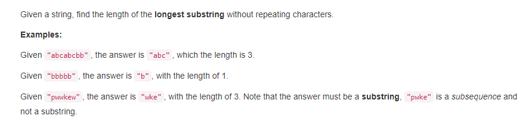
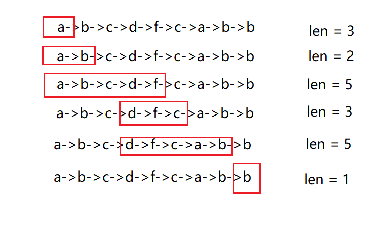

## #3 求字符串中不包含重复字符的最大长度子串
### 问题描述

给定一个字符串，求出该字符串中不包含重复字符的最大长度子串的长度。
测试用例：
> "abcabcbb" -> 最大子串"abc"，长度是3 <br/>
  "bbbbb" -> 最大子串"b"，长度是1 <br/>
  "pwwkew" -> 最大子串"wke"，长度是3
  
## 解答
遍历字符串，我们假设有个窗口，这个窗口在从字符串左侧开始由左向右移动，窗口中包含的是字符串中没有重复字符的子串。
我们以字符串`abcdfcab`为例，窗口先包含`a`,遍历到`b`,窗口中不包含`b`,则将`b`添加到窗口中，以此类推一直到`f`，再到`c`，
因为窗口中已经有`c`,记录当前`max_len = max(len,max_len)`,`max_len`初始值为0，此时，窗口去掉之前从`a`到第一个`c`的部分，
并把第二个c加进来，保证窗口中字符的唯一性，以此类推直到结束字符串遍历，返回`max_len`即为最优解。

如下图，max_len = 5


```python
class Solution(object):
    def lengthOfLongestSubstring(self, s):
            """
            :type s: str
            :rtype: int
            """
            list = []   # 窗口
            max_size = 0
            i = 0
            while i < len(s):   #遍历字符串
                if not s[i] in list:
                    list.append(s[i])  #如果不在窗口中，则放入窗口
                else:
                    max_size = max(max_size, len(list))  #保存当前最大的len
                    list = list[list.index(s[i]) + 1:]   #截取窗口从重复字符之前的部分，包括重复的字符本身
                    list.append(s[i])                    #将新的字符放进窗口

                i += 1

            max_size = max(max_size, len(list))

            return max_size
```
    