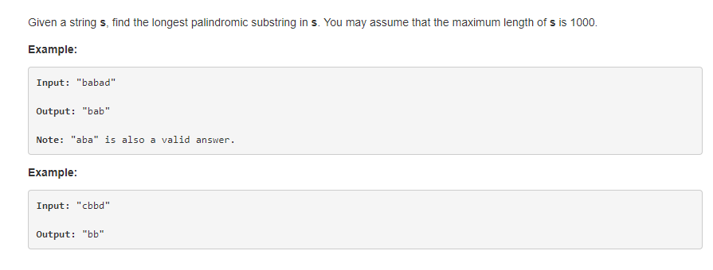
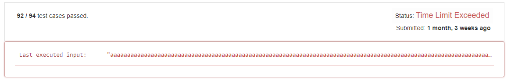

## #5 求字符串的最长回文子串
### 问题描述

给定一个字符串s，找出s中的最长回文子串，可以假设字符串s的长度不超过1000。
用例:
> 输入："babad" <br/>
  输出："bab"   <br/>
  说明："aba" 也是一个正确的答案
  
> 输入："cbbd" <br/>
  输出："bb"
  
### 解答
#### 暴力模式
思路也很简单，遍历s，假设当前值为item，下标为index，进入第二层遍历，反向遍历s，如果找到与item相等的字符，假设下标为rindex，
则开始第三层遍历rindex,和index同时向中间遍历，如果s[index]=s[rindex],直到index=rindex，则从index->rindex为s的一个回文子串，、
放入dict中，如果s[index]!=[rindex],则表示从index->rindex不是s的回文子串，回到第二层遍历rindex（上一个item的地方）继续从右向
左遍历找到与item相等的值，如果找到item,重复index->rindex的回文校验，否则index++，继续第一次层遍历,知道第一层遍历结束。

在暴力模式下，我们把所有的回文存放在dict中，总共经历了三层遍历，所以时间复杂度是O(n^3)，使用中间变量max_length保存最大的
回文长度，遍历结束时返回dict[max_length],即为最优解。
代码实现如下：
```python
#暴力模式
def longestPalindrome(s):
    """
    :type s: str
    :rtype: str
    """
    max_length = 0
    dict = {}
    for index, item in enumerate(s):
        if item in s[index + 1:]: 
            m = s.rindex(item)

            while m > 0:
                j = m
                for i in range(index, len(s)):
                    if i >= j:
                        # 回文
                        str = s[index:m + 1]
                        max_length = max(len(s[index:m + 1]), max_length)
                        dict[len(s[index:m + 1])] = str
                        break

                    if s[i] != s[j]:
                        break
                    else:
                        i += 1
                        j -= 1

                m = s[:m].rindex(item)

    if len(dict) > 0:
        return dict[max_length]
    else:
        return s[0]
```
在leetcode中，如果提交以上代码，会发生超时，在有时间限制的前提下是通不过的。


### 回文中心扩展
现在我们换个思路，回文具有两种性质，其中P(i,j)表示下标从i，到j的字符串，
Sk表示字符串s在k下标的值。
1. (P(i+1,j−1) and S(​i)==S​(j) <br/>
P(i+1,j-1)是回文，并且S(i)==S(j)，则p(i,j)是回文
2. p(i,i) = true and  p(i,i+1) == (S(i) == S(i+1)) <br/>
p(i,i)是回文(单个字符是回文)，p(i,i+1)是否是回文取决于S(i) 和 S(i+1)是否相等

遍历s，在遍历的过程中以当前的值item（下标为index)作为回文的中心点，尽量向两边扩展。以item作为中心点有两种
情况,一种是S(index)=S(index+1),一种是S(index+1)=S(index-1)，两种情况中取回文长度最长的那个，知道s遍历结束
在这种情况下，只有两层遍历，时间复杂度位O(n^2)。

实现如下:
```python
def getPalindrome(s, start, end):  #start 和 end 为回文的左右初始扩展点
    i = 0
    while i < start + 1 and i < len(s) - end:
        if s[start - i] != s[end + i]:
            i -= 1
            break

        i += 1
    else:
        i -= 1

    return s[start - i:end + i + 1]

def longestPalindrome_dynamic(s):
    max_palindrome = s[0]
    for index, value in enumerate(s):
        palindrome_middle = getPalindrome(s, index, index)
        if len(max_palindrome) < len(palindrome_middle):
            max_palindrome = palindrome_middle

        if index < len(s)-1 and value == s[index + 1]:
            palindrome = getPalindrome(s, index, index + 1)
            if len(palindrome) > len(max_palindrome):
                max_palindrome = palindrome

    return max_palindrome
```