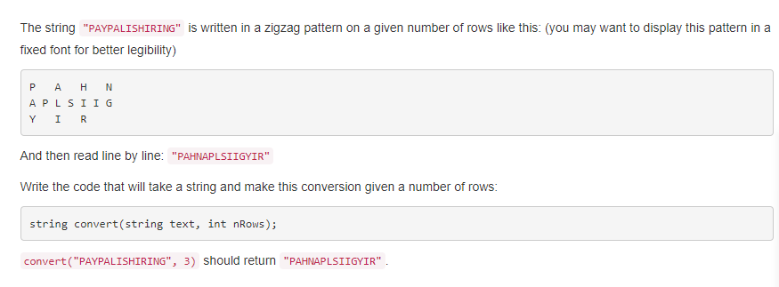

## #6 字符串的Z型变换
### 问题描述

字符串"PAYPALISHIRING"在给定行数的情况下，Z型模式如上图所以，从横向读字符串即为: "PAHNAPLSIIGYIR",给定
字符串和行数完成代码`string convert(string text, int nRows)`的实现，如给定convert("PAYPALISHIRING",3)
则返回"PAHNAPLSIIGYIR"。

### 解答
